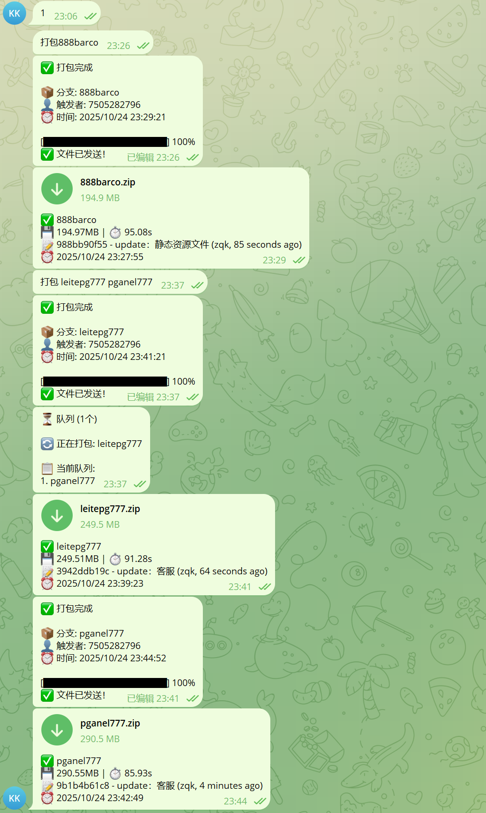

# WG-WEB Telegram 自动打包机器人

通过 Telegram 消息触发 WG-WEB 项目的自动打包和分发。

**⚠️ 当前使用用户账号模式（User Bot），可发送最大 2GB 的文件！**

## 功能特性

- 📦 发送分支名即可自动打包
- 🚀 自动拉取最新代码
- 📝 显示最新 commit 信息
- 📊 显示构建耗时和文件大小
- 🤖 自动发送打包文件到群组
- 🔐 支持用户权限控制
- 🌿 支持多分支构建

## 安装步骤

### 1. 安装依赖

```bash
cd telegram-bot
npm install
```

### 2. 获取 Telegram API 凭证

访问 https://my.telegram.org/apps

1. 用你的手机号登录
2. 点击 "API development tools"
3. 填写应用信息：
   - App title: `WG-WEB Builder`
   - Short name: `wgbuilder`
   - Platform: `Desktop`
4. 创建后获取：
   - **api_id**（数字）
   - **api_hash**（字符串）

### 3. 配置 .env 文件

编辑 `.env` 文件：

```env
# Telegram 用户账号配置
API_ID=你的api_id
API_HASH=你的api_hash
PHONE_NUMBER=+8613800138000  # 你的手机号（带国家码）
CHAT_ID=-1001234567890       # 目标群组ID（可选，留空则处理所有群组）

# 项目配置
BUILD_PROJECT_PATH=../WG-WEB
ALLOWED_USERS=               # 可选：允许的用户ID列表
```

### 4. 获取群组 ID（可选）

如果你想限制只在特定群组工作：

1. 启动程序：`npm start`
2. 首次运行会要求输入验证码，按提示操作
3. 在任意群组发送消息
4. 查看控制台输出的"群组ID"
5. 将 ID 填入 `.env` 的 `CHAT_ID`

### 5. 克隆打包仓库

在 `PackageRepos` 目录下克隆一个专门用于打包的仓库：

```bash
cd ../
git clone <你的WG-WEB仓库地址> WG-WEB-Build
cd WG-WEB-Build
npm install
```

目录结构应该是：
```
PackageRepos/
├── telegram-bot/        # 本项目
├── WG-WEB/             # 开发目录
└── WG-WEB-Build/       # 打包专用目录
```

## 使用方法

### 启动 Bot

```bash
npm start
```

或使用 nodemon 自动重启（开发模式）：

```bash
npm run dev
```

### Bot 命令

在 Telegram 群组中：

| 命令 | 说明 |
|------|------|
| `/start` | 显示帮助信息 |
| `/branches` | 查看可用分支列表 |
| `/status` | 查看配置状态 |
| `main` | 打包 main 分支 |
| `dev` | 打包 dev 分支 |
| `<分支名>` | 打包指定分支 |

### 打包流程

1. 在群组中发送分支名，例如：`main`
2. Bot 自动执行：
   - ✅ 切换到指定分支
   - ✅ 拉取最新代码
   - ✅ 安装/更新依赖
   - ✅ 执行 `npm run build`
   - ✅ 压缩 dist 文件夹
   - ✅ 发送到群组
3. 接收打包文件 `dist-<分支>-<时间>.zip`

## 配置说明

### .env 配置项

| 配置项 | 必填 | 说明 |
|--------|------|------|
| `BOT_TOKEN` | ✅ | Telegram Bot Token |
| `CHAT_ID` | ✅ | 接收打包文件的群组 ID |
| `BUILD_PROJECT_PATH` | ❌ | WG-WEB-Build 路径，默认 `../WG-WEB-Build` |
| `ALLOWED_USERS` | ❌ | 允许使用的用户 ID，逗号分隔，留空不限制 |

### config.js 高级配置

```javascript
{
  build: {
    buildCommand: 'npm run build',     // 构建命令
    distPath: 'dist',                  // 输出目录
    zipOutputPath: './builds',         // zip 存放目录
    autoInstall: true,                 // 是否每次都 npm install
    allowedBranches: []                // 允许的分支，留空不限制
  }
}
```

## 权限控制

### 限制特定用户使用

1. 获取你的用户 ID：
   - 向 bot 发送消息
   - 查看控制台输出的 "用户ID"

2. 在 `.env` 中配置：
```env
ALLOWED_USERS=123456789,987654321
```

### 限制可打包的分支

在 `config.js` 中配置：
```javascript
allowedBranches: ['main', 'dev', 'release']
```

## 常见问题

### 1. Bot 没有响应
- 检查 Bot Token 是否正确
- 确认 bot 已添加到群组
- 查看控制台是否有错误信息

### 2. 无法获取群组 ID
- 确保 bot 已被添加到群组并有权限
- 在群组发送消息后查看控制台
- 或访问 getUpdates API

### 3. 构建失败
- 检查 WG-WEB-Build 目录是否存在
- 确认该目录是完整的 Git 仓库
- 检查分支名是否正确
- 查看控制台的详细错误信息

### 4. 文件发送失败
- 检查文件大小（Telegram 限制 50MB）
- 确认 bot 在群组中有发送文件权限
- 检查网络连接

## 开发说明

### 项目结构

```
telegram-bot/
├── index.js              # 主程序，处理 Telegram 消息
├── builder.js            # 构建逻辑，执行 git/npm 命令
├── config.js             # 配置管理
├── package.json          # 依赖配置
├── .env                  # 环境变量（不提交到 Git）
├── .env.example          # 配置示例
└── builds/               # 临时存放 zip 文件（自动创建）
```

### 修改构建流程

编辑 `builder.js` 中的 `fullBuild` 方法。

### 添加新命令

在 `index.js` 中的 `bot.on('message')` 添加处理逻辑。

## 注意事项

⚠️ **安全提示**：
- 不要将 `.env` 文件提交到 Git
- 不要公开你的 Bot Token
- 建议设置 `ALLOWED_USERS` 限制使用权限

⚠️ **资源占用**：
- 打包过程会占用 CPU 和内存
- 建议在服务器资源充足时使用
- 可以限制并发打包数量（当前不支持，可扩展）

## 维护

### 更新依赖

```bash
npm update
```

### 清理构建文件

```bash
rm -rf builds/*.zip
```

### 后台运行（Linux）

使用 PM2：
```bash
npm install -g pm2
pm2 start index.js --name wg-telegram-bot
pm2 logs wg-telegram-bot
```

使用 screen：
```bash
screen -S telegram-bot
npm start
# Ctrl+A+D 退出
```

## License

MIT

